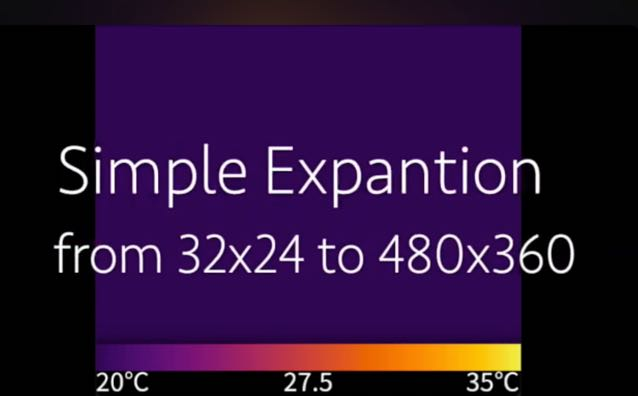

# MLX90640Viewer

The MLX90640Viewer is a tool that applies heatmaps and visualizes the output of the [Melexis MLX90640 32x24 IR array][1], which is stored as continuous raw data in a file.

## How to use

This software runs on [Processing][2]. To play a file, specify the data file in the constructor of the `Viewer` class and use the control methods of the same class.

```c++
// MLX90640 raw file
String file = "./data/mlx0100.raw";

Viewer viewer;

void setup() {
  size(480, 420);
  frameRate(16);
  viewer = new Viewer(file);
}

void draw() {
  viewer.Draw();
  if (!viewer.Next()) {
    viewer.Rewind();
  }
}
```

### `Viewer` class methods

- **`Viewer::Viewer(String file_path)`**  
    In the constructor of the `Viewer` class, specify the path of the file to be played. Specify the file name with an absolute path or a relative path from the sketch folder where `Viewer.pde` is located.

- **`void SetAutoRange(boolean autoRange)`**  
    Specify `true` to automatically follow the temperature range to be rendered. If `false`, it will be set to 20°C to 35°C.

- **`void SetRange(int minTemp, int maxTemp)`**  
    Set it to a fixed temperature range for rendering.

- **`void SetInterpolation(boolean interpolation)`**  
    Apply [Bilinear Interpolation][3] when rendering. Default is `true`.

- **`void SetFilterSize(int filterSize)`**  
    Specifies the size of the [Gaussian blur filter][4] applied when the bilinear interpolation setting is `false`. The default is `7`. A value of `0` will not apply any filter and will render a thermal image that is simply scaled up from the original data.

- **`void Rewind()`**  
    Rewinds the thermal image to the beginning of the frame.

- **`void Draw()`**  
    Renders the current thermal image frame.

- **`boolean Next()`**  
    Proceeds the thermal image to the next frame, returning `false` if executed beyond the last frame.

- **`boolean Prev()`**  
    Rewinds the thermal image to the previous frame, returning `false` if executed beyond the first frame.

## Rendering heatmap

The heatmap was calculated by sampling "Inferno" from the [Matplotlib][5] and using polynomial approximation on the created RGB graph.


## Demo

[](https://youtu.be/dhfZa0TYN0s "MLX90640 raw data viewer using Processing - YouTube")

[1]: https://www.melexis.com/en/product/mlx90640/far-infrared-thermal-sensor-array "Far Infrared Thermal Sensor Array (32x24 RES) ｜ Melexis"

[2]: https://processing.org/ "Welcome to Processing! / Processing.org"

[3]: https://en.wikipedia.org/wiki/Bilinear_interpolation "Bilinear interpolation - Wikipedia"

[4]: https://en.wikipedia.org/wiki/Gaussian_blur "Gaussian blur - Wikipedia"

[5]: https://matplotlib.org/stable/users/explain/colors/colormaps.html "Choosing Colormaps in Matplotlib &#8212; Matplotlib 3.9.3 documentation"
